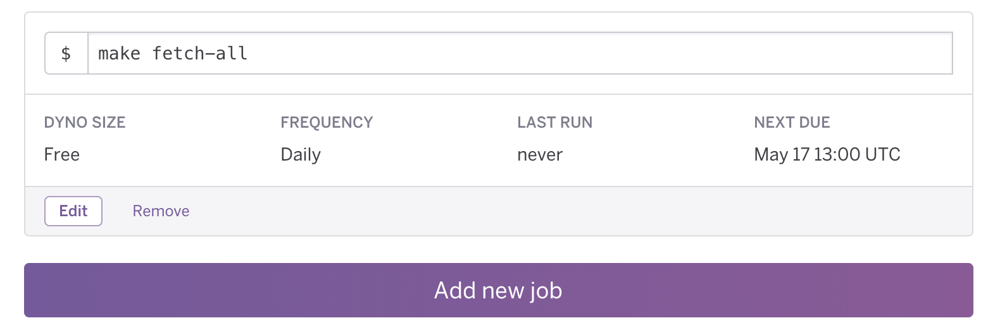

# data.world & Redshift Connector

## Getting Started

1. [Create a dataset](https://data.world/create-a-dataset) on data.world to hold your Redshift data
2. You will need your own [Heroku](https://www.heroku.com) account
3. Deploy to Heroku by pressing the fancy-looking button above
    * This integration was designed to save all of the Redshift tables into one dataset, but can be configured to save
    to multiple datasets. Take a look at the [Storing Tables in Multiple Datasets](#storing-tables-in-multiple-datasets)
    section.
    * Take a look at the [Config Vars](#config-vars) section for more details on the individual configuration variables
    * The initial deployment will take a couple of minutes as it's pulling all of your data
4. Once deployment is done, click on 'Manage App' to go to the app's 'Overview' page
5. Under 'Installed add-ons', click on 'Heroku Scheduler'
6. Add a new job. The command to use is `make fetch-all`.
    * Note that this will fetch all of the data from your Redshift database every time. A better process would be to
    fetch only the data that has been updated since last run. Take a look at the [Incremental Updates](#incremental-updates)
    for info on setting that up. 

As an example, the following job is scheduled to run daily at 8 AM CDT:

### Incremental Updates

1. Make changes to catalog.json
2. Change the command in scheduler (`make update`)

#### Storing Tables in Multiple Datasets

### Config Vars

 * `DW_TOKEN:` Pay a visit to https://data.world/settings/advanced and copy the Read/Write token
 * `DW_DATASET_OWNER:` As an example, if the URL of your dataset were https://data.world/my-org/my-cool-dataset,
 the dataset owner would be `my-org`
 * `DW_DATASET_ID:` In the example above, the dataset id would be `my-cool-dataset`
 * `REDSHIFT_HOST:` Endpoint of the Redshift cluster
 * `REDSHIFT_PORT:` Port used to access the Redshift cluster
 * `REDSHIFT_DBNAME:` Database to access
 * `REDSHIFT_USER:` User authorized to access the Redshift cluster
 * `REDSHIFT_PASSWORD:` Password for the above user
 
### Contributing

This integration has been released as an open-source project. Community participation is encouraged and highly
appreciated. If you'd like to contribute, please follow the [Contributing Guidelines](CONTRIBUTING.md).

### Support

For support, either create a [new issue](https://github.com/datadotworld/dw-redshift-connector/issues) here on
GitHub, or send an email to help@data.world.
