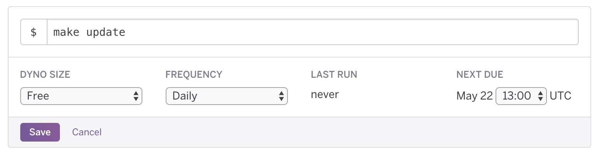

# data.world & Redshift Connector

## Getting Started

1. [Create a dataset](https://data.world/create-a-dataset) on data.world to hold your Redshift data
2. [Create a second dataset](https://data.world/create-a-dataset) for the configuration files and the logs. The same
dataset from above can be used, though.
3. You will need your own [Heroku](https://www.heroku.com) account
4. Deploy to Heroku by pressing the fancy-looking button above
    * This integration was designed to save all of the Redshift tables into one dataset, but can be configured to save
    to multiple datasets. Take a look at the [Storing Tables in Multiple Datasets](#storing-tables-in-multiple-datasets)
    section.
    * Take a look at the [Config Vars](#config-vars) section for more details on the individual configuration variables
5. Once deployment is done, click on 'Manage App' to go to the app's 'Overview' page
6. Under 'Installed add-ons', click on 'Heroku Scheduler'
7. Add a new job. The command to use is `make update`.
    * Note that this will fetch all of the data from your Redshift database every time. A better process would be to
    fetch only the data that has been updated since last run. Take a look at the [Incremental Updates](#incremental-updates)
    for info on setting that up.

As an example, the following job is scheduled to run daily at 8 AM CDT:

8. Visit the config dataset (`DW_CONFIG_DATASET_ID`) and download the catalog configuration file. By default, all the
tables are deselected. To enable a table to import to data.world, simply add an `*` in the 'selected' column.  
9. If you wish to get the data immediately, trigger a manual run as described in [Manual Run](#manual-run)

### Manual Run

To trigger a manual update, click on 'More' on the upper right-hand corner, and then 'Run console' (screenshot below).
Type `make update` on the screen that pops up and press 'Run'.

### Generate a New Catalog Configuration

The configuration file for the catalog is only generated at first-run but it's possible to force a refresh. To do so,
follow the instructions laid out in [Manual Run](#manual-run) but type `make push-catalog-config` instead. Please note
that all of the tables will be deselected.

### Storing Tables in Multiple Datasets

Simply deploy it multiple times and specify what tables go where by configuring the catalogs accordingly.

The same configuration dataset can be used for all of your data datasets.

### Incremental Updates

Coming soon.

### Config Vars

 * `DW_TOKEN:` Pay a visit to https://data.world/settings/advanced and copy the Read/Write token
 * `DW_DATASET_OWNER:` As an example, if the URL of your dataset were https://data.world/my-org/my-cool-dataset,
 the dataset owner would be `my-org`
 * `DW_DATASET_ID:` Dataset that will hold all of the Redshift data. In the example above, the dataset id would be
 `my-cool-dataset`.
 * `DW_CONFIG_DATASET_ID:` Dataset that will hold the Redshift configuration files and the logs. Can be the same
 dataset as above.
 * `REDSHIFT_HOST:` Endpoint of the Redshift cluster
 * `REDSHIFT_PORT:` Port used to access the Redshift cluster
 * `REDSHIFT_DBNAME:` Database to access
 * `REDSHIFT_USER:` User authorized to access the Redshift cluster
 * `REDSHIFT_PASSWORD:` Password for the above user
 * `REDSHIFT_START_DATE:` First date to gather data from, in UTC. Format: 2017-01-01T00:00:00Z
 
### Contributing

This integration has been released as an open-source project. Community participation is encouraged and highly
appreciated. If you'd like to contribute, please follow the [Contributing Guidelines](CONTRIBUTING.md).

### Support

For support, either create a [new issue](https://github.com/datadotworld/dw-redshift-connector/issues) here on
GitHub, or send an email to help@data.world.
